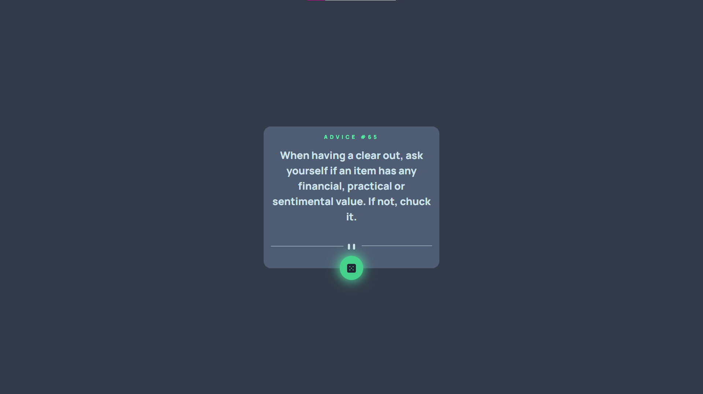

# Frontend Mentor - Advice generator app solution

This is a solution to the [Advice generator app challenge on Frontend Mentor](https://www.frontendmentor.io/challenges/advice-generator-app-QdUG-13db). Frontend Mentor challenges help you improve your coding skills by building realistic projects.

### The challenge

Users should be able to:

-   View the optimal layout for the app depending on their device's screen size
-   See hover states for all interactive elements on the page
-   Generate a new piece of advice by clicking the dice icon

### Screenshot

### Links

-   Solution URL: [Add solution URL here](https://github.com/wertmullerf/advice-app-generator)
-   Live Site URL: [Add live site URL here](http://advice-app-generator-woad.vercel.app/)

### Built with

-   Semantic HTML5 markup
-   CSS custom properties
-   Flexbox
-   CSS Grid
-   Mobile-first workflow
-   [React](https://reactjs.org/) - JS library

## Author

-   Website - [Facundo Wertmuller]
-   Frontend Mentor - [@wertmullerf](https://www.frontendmentor.io/profile/wertmullerf)
-   GitHub - [@wertmullerf](https://github.com/wertmullerf)
